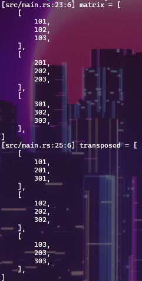
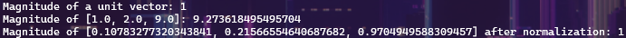

# Types & Values
1. `Static Typing` - `For Type Safety`
2. `Variables are basically immutable`
    `let x:i32 = 10;`
3. `Values - Types - Literals`
	`Signed Integers` : i8 ,i16, i64, i128, isize
	  -10, 0, 1_000, 123_i64
	`Unsigned Integers` : u8, u16, u32, u64, u128, usize
	   	0, 123, 10_u16
	`Floating point numbers` : f32, f64
	   	3.14, -10.0e20, 2_f32
   `Unicode scalar values` : char
	   'a', 'α', '∞'
	`Booleans` :  bool
		true, false
4. `Type Inference`
```rust
fn put_u32(x: u32){
	println!("u32 : {x}");
}
fn main() {
	let x = 10;
	let y = 2.0;
	put_u32(x);
	//put_u32(y);
}
```
5. Macros
```rust
println!();
format!();
dbg!()
todo!()
```
>`function` 에서 값을 반환하기 위해 `return val;` 으로 해도 되지만,  그냥 `val` 만 해도 괜찮다.
#### <span style="color:rgb(0, 176, 240)"> Exercise</span>
`./fib`
`./collatz`
# Tuples & Arrays
1. `Arrays`
```rust
- Default
fixed length
- Initialization
a. [0; 1024]
b. [T; N]
	[u8; 4]
```
>`debug Output` 으로 `{:?}` 을 사용할 수 있으며, `#` 을 넣으면서 `pretty printing` 포맷을 형성할 수 있다.
>e.g. `{a:#?}`
2. `Tuples`
```rust
- Default
Fixed length
Access : dot operator like t.0, t.1...
empty tuple : `()`
```
3. `Array Iteration`
```rust 
`for` statement 는 array 의 iteration 을 지원하며, `IntoIterator Trait` `Funtionality` 를 사용하는 것이다.
```
4. `Patterns and Destructuring`
	1. `irrefutable` 
			컴파일러가 정적으로 확인할 수 있다는 의미.
			`let (a1, a2, a3) = tuple;` 이 있을 때 `tuple` 이라는 변수도 같은 구조를 가졌다는 것을 컴파일러가 확인할 수 있는 상황을 의미한다.
#### <span style="color:rgb(0, 176, 240)"> Exercise</span>
`./nested`

# References
1. `Shared References`
	`Rust` 에서 변수의 기본 속성은 `immutable` 이며, `Ownership` 개념에 영향을 받는다. 
	이때 다른 값에 대한 `Ownership` 을 가져오는 대신 `Borrowing` 을 해서 접근할 수 있다.
	그러나 기본적으로 `Shared Reference` 들은 `Read-Only` 이므로 값을 마음대로 바꾸는 것은 어렵다.
```rust
let mut data: &char = &refered_data;
```
	`& operator`
	`* operator : dereferences a reference`
2. `Exclusive References`	
	`mutable references` 라고도 불리며, 값을 바꿀 수 있다.
```rust
let mut dat = (1,2); // not immutable
let pointed = &mut dat.1; // mutable reference
*pointed = 34; // dereference a reference
```
3. `Slices`
	`rust` 의 `slicing` 문법에도 `borrow` 개념이 적용된다.
```rust
let data:[u32, 5] = [32,34,12,12,12];
let sliced: &[u32] = &data[3..4];
```
보면 `sliced` 의 `type` 이 지정돼 있지만. 길이가 명시돼 있지 않다. 이러한 방식으로 다른 크기의 `slicing` 도 가능하게 되는 것이다.
4. `Strings`
	`&str : a slice of UTF-8 encoded bytes, similar to &[u8].`
	`String : an owned buffer of UTF-8 encoded bytes, similar to Vec<T>.`
	`String` 타입은 `wrapper(a vector of bytes/Vec<T>)` 이다.
```rust
let s1:&str = "world";
let mut s2:String = String::from("Hello");
s2.push_str(s1);
let s3: &str = &s2[2..5];
```
5. `Reference Validity`
	`Rust` 에서 `references` 는 `null` 이 될 수 없다.
#### <span style="color:rgb(0, 176, 240)"> Exercise</span>
`./geometry`

# User-Defined Types
1. `Named Structs`
```rust
struct Person {
	name: String,
	age: u8
}
...
let mut justin = Person {
	name: String::from("kim jung"),
	age: 561,
}
...
```
2. `Tuple Structs`
```rust
struct Point(u32,u32);
struct NewTypes(f64); // single-field wrapper, called newtypes
```
3. `enums`
```rust
#[derive(Debug)]
enum coord {
	x,
	y,
	z,
}
enum attack {
	Push {x:u32, y:u32,z:u32} , // Struct variant
	Start(coord), // Tuple variant
	End, // simple variant	
}
```
4. `Type Aliases`
```rust
use std:cell:Refcell;
use std:sync::{arc, RwLock};
type Player = RwLock<Vec<Arc<RefCell<Item>>>>;
```
5. `const & static`
	`static` 으로 선언된 `value` 는 전역 변수와 비슷하다.
	따라서 `Sync` 될 필요가 있는데, `Interior Mutability` 는 `Mutex, atomic` 등을 이용해서 처리할 수 있다.
#### <span style="color:rgb(0, 176, 240)"> Exercise</span>
`./elevator`

